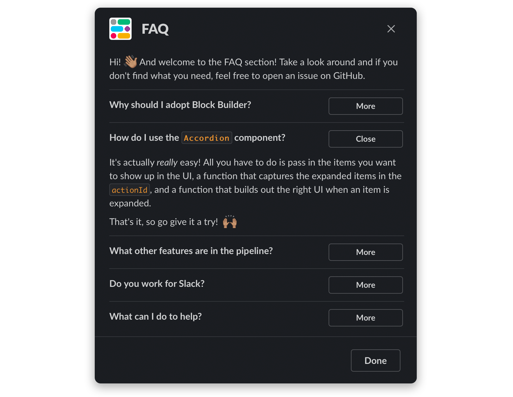

# Accordion

?> **Note:** This document is a reference for using the `Accordion` component in **Block Builder**. For information on the business logic for the blocks in the context of the Slack Block Kit framework, visit [the official doc site](https://api.slack.com/block-kit) from Slack.

**Block Builder** provides a component for creating a UI with items that can be expanded and collapsed, called `Accordion`. It is one of a few UI components available in the library:

The `Accordion`:

* Generates a ready-to-use UI for expandable/collapsable content.
* Lets you pass in an array of objects and a function to use to build the UI for each item in the list when expanded.
* Provides context to your action IDs that can be passed back to your app's backend when a user clicks a button to expand or collapse an item that can be then be passed back into the accordion component to generate the next UI state.
* Supports the option to collapse all items when a new one is expanded.
* Allows you to customize the UI copy.

### Example

```javascript
import { Modal, Blocks, Accordion } from 'slack-block-builder';

export default ({ faqs, expandedItems }) => Modal({ title: 'FAQ' })
  .blocks(
    Blocks.Section({ text: 'Hi! :wave: And welcome to the FAQ section! Take a look around and if you don\'t find what you need, feel free to open an issue on GitHub.'}),
    Blocks.Divider(),
    Accordion({
      items: faqs,
      expandedItems: expandedItems || [], // In this case, the value is [1]
      collapseOnExpand: true,
      titleText: ({ item }) => `*${item.question}*`,
      actionId: ({ expandedItems }) => JSON.stringify({ action: 'render-faqs', expandedItems }),
      blocksForExpanded: ({ item }) => [
       Blocks.Section({ text: `${item.answer}` }),
      ],
    }).getBlocks())
  .close('Done')
  .buildToJSON();
```

The above code example produces the following UI. The `action_id` for each button contains data (an array of integers) about the next state of the UI.



### Using the Accordion 

An accordion component can be created using the `Accordion` function, which is available as both a top-level import and as a member of the `Components` object.

The `getBlocks()` method returns the result blocks to be added to the intended surface object.

```javascript
import { Accordion } from 'slack-block-builder';

const accordion = Accordion(params);
const blocks = accordion.getBlocks();
```

```javascript
import { Accordion } from 'slack-block-builder';

const accordion = Components.Accordion(params);
const blocks = accordion.getBlocks();
```

When using with TypeScript, you'll want to dictate the shape of the objects being passed in:

```javascript
import { Accordion } from 'slack-block-builder';

const accordion = Accordion<Entity>(params);
const blocks = accordion.getBlocks();
```

### Params  

`items` – *Array*

An array of the items that are to be included in the expandable list.

`expandedItems` – *Array*

An array of integers (indexes of expanded items) that dictates which items should be expanded. Should default to either `[]` for all items to be collapsed, or `[items[index]]` for a default expanded item. Then it should be updated with each view update using the data provided in the `action_id` of each button.

`titleText` – *Function*

This is a function called to create the `action_id` of the Next and Previous buttons. See below for more details.

`actionId` – *Function*

This is a function called to create the `action_id` of the buttons used to expand or collapse an item. See below for more details.

`blocksForExpanded` – *Function*

The function that is called for each expanded item that should return the blocks to be displayed. See below for more details.

`collapseOnExpand` – *Boolean* `Optional`

When set to `true`, only one item will be expanded at any given time. Expanding a new item will collapse the currently expanded one. Defaults to `false`.

`expandButtonText` – *String* `Optional`

Used to customize the text for the expand button, which defaults to `'More'`.

`collapseButton` – *String* `Optional`

Used to customize the text for the collapse button, which defaults to `'Close'`.

### The `titleText` Function

The `titleText` parameter accepts a function that takes an object that contains one of the items from the data set and returns a string to display as the title, next to the collapse/expand button. The object, at the moment, contains only one parameter, `item`, which is the item for which the title will be displayed.

### The `actionId` Function

The point of the `actionId` parameter is to provide a way to persist data back to your app's backend when a user clicks a button to expand or collapse an item. 

The `actionId` parameter accepts a function that takes an object with, at the moment, a single parameter `expandedItems`, which is an arrray of integers, and returns a string that is then passed into the `action_id` of the collapse or expand buttons.   

The data can be mutated into a string however you see it, depending on how your application works, for example: 

```javascript
const actionId = ({ expandedItems }) => JSON.stringify({
  expandedItems,
  action: 'render-certain-modal', 
});
```

Which would result in the following value, on a modal where the third item is expanded, and the fifth is clicked:

```javascript
// if collapseOnExpand is set to true

'{"expandedItems":[4],"action":"render-certain-modal"}'

// if collapseOnExpand is set to false

'{"expandedItems":[2,4],"action":"render-certain-modal"}'
```
  
Please visit [the demo repo on GitHub](https://github.com/raycharius/slack-block-builder-demo) to view an example of how this can be used.

### The `blocksForExpanded` Function

The `blocksForExpanded` parameter accepts a function that takes an object that contains one of the items from the data set and returns an array of blocks to display for that item when it is expanded. The object, at the moment, contains only one parameter, `item`, which is the item for which the blocks will be created.  
 
